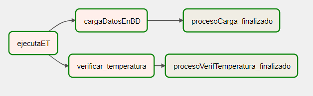
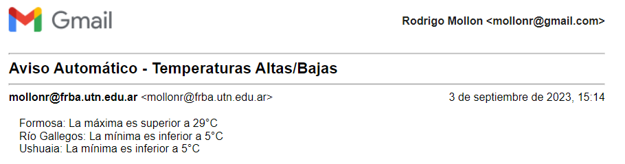

# Coderhouse's Data Engineering Flex (55145) Final Project
### Developed by Rodrigo Mollon

## Requirements
- Have Docker

## Description
This code gives you all the tools to run the specific DAG called `ProyectoFinal_Mollon.py`.

What this DAG does is:

1. Pulls data from the Openweathermap API (https://openweathermap.org/)
2. Saves that data into a Amazon Redshift Database.
3. Checks if there is any temperatura above 29ºC or belowe 5ºC and sends an email reporting in which place it happened, in case there is no temperature outside of those limits it also sends an email reporting that situation.

## Configuring your credentials
All credentials configurations have already been made.

## Usage
It's easy, just do:

1. `docker-compose build`
2. `docker-compose up`
3. Enter `localhost:8080` in whatever browser you want.
4. Airflow credentials are the default values.
5. Once inside, activate the DAG, wait for it to turn dark green and voila! The pipeline ran.
6. To kill everything, you can use `docker-compose down`

